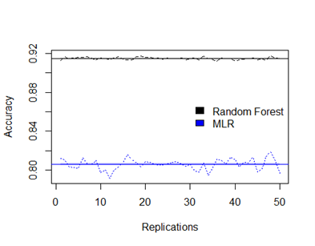

# Satellite Images Prediction with Random Forests and Multinomila Logistic Regression
In this report, random forests and multinomial logistic regression are used on the dataset Satellite
available in package ***mlbench*** contains 6435 images displaying different scenes recorded by the
Landsat satellite program. Each row of the data correspond to an image, which encodes a scene in
terms of 36 features extracted from multi-spectral values of pixels in 3x3 neighborhoods of the
image.

The task is to predict the classification of the satellite images. In doing so, both models are
compared and based on the generalization performance evaluation, we can find the best model.

## Data Set 
Satellite from mlbench package. 

## Models
- Random Forest
- Multinomial Logistic Regression

Here is the steps of both methods and predictive performance for the data. 
1. Data Preparation 
2. Fitting Both Models 
3. Check the Fold Accuracy

The figure below is the average fold accuracy for random forest and multinomial logistic regression model in all replications. The random forest has average around **91.4%** and the standard deviation of mean accuracy for all replications are good, below **1%**, while the multinomial logistic regression has a lower accuracy around **80.6%**.

Overall, the ***random forest*** model has a better average accuracy and a lower variability in the estimates compared to the multinomial logistic regression. In every comparison, we store the best model in variable best. In every replication, Random forest is the best model. 

> Predictive Performance: After applying the best model to the dataset, it shows that the predictive performance of the Random Forest is very good with **91%** accuracy. We can use it for the better prediction of the satellite images classification.
